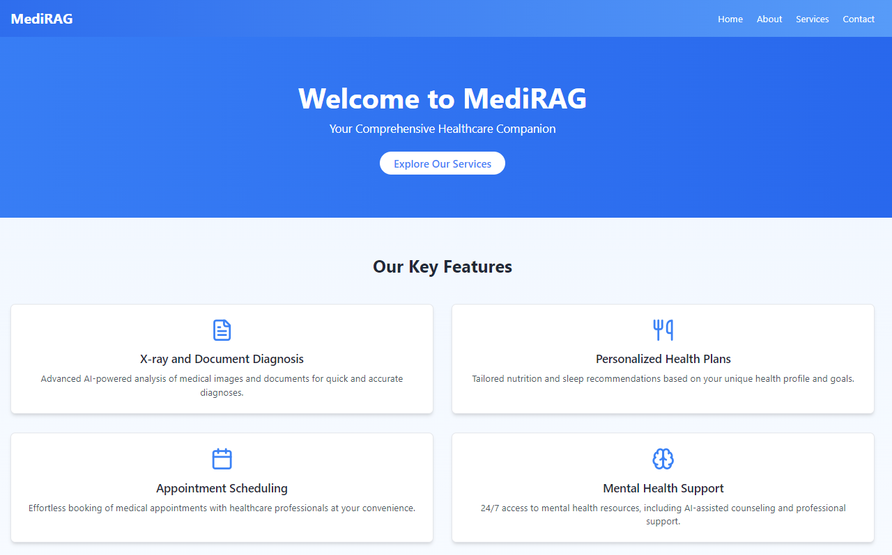
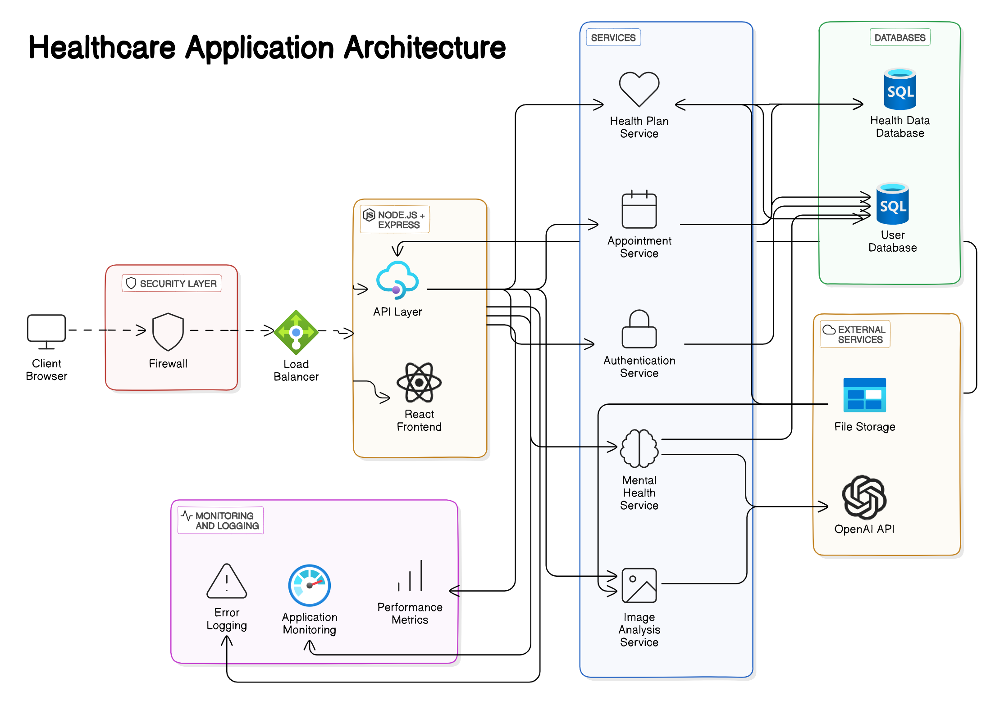
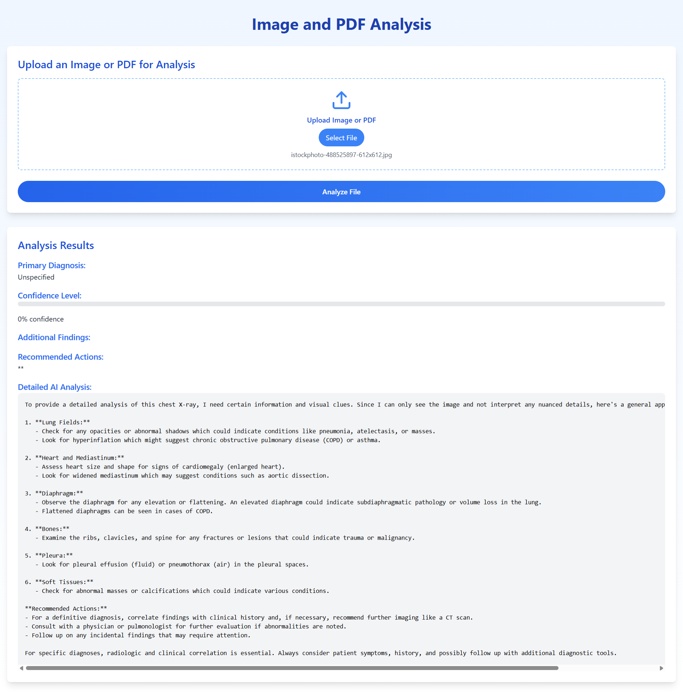
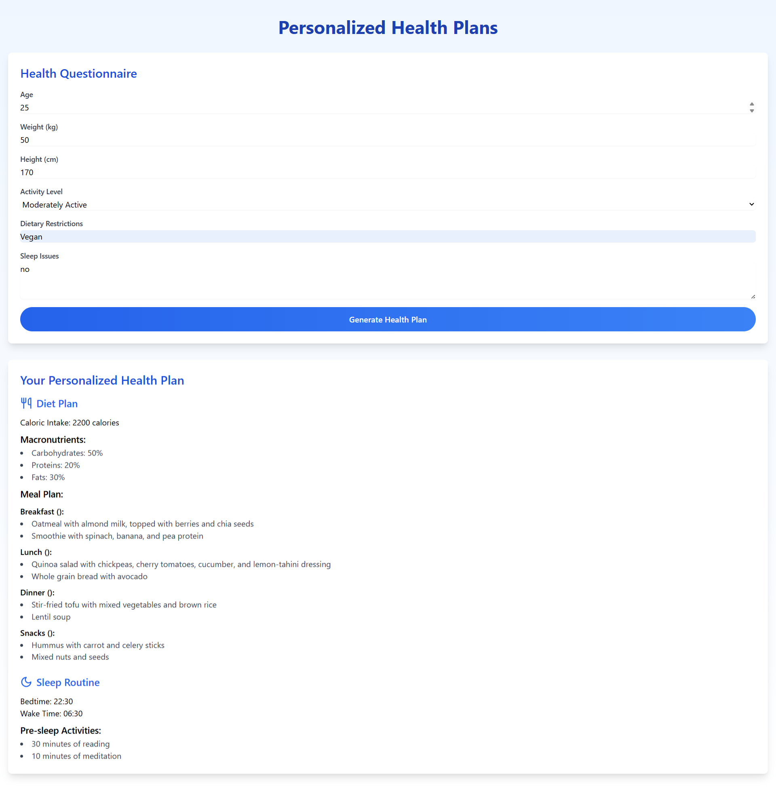
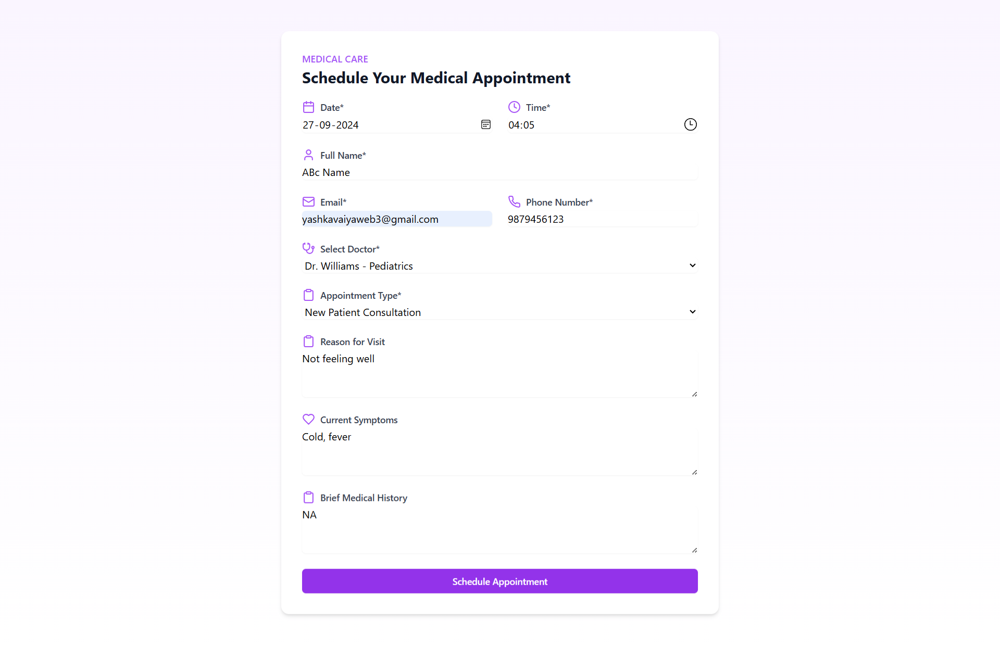
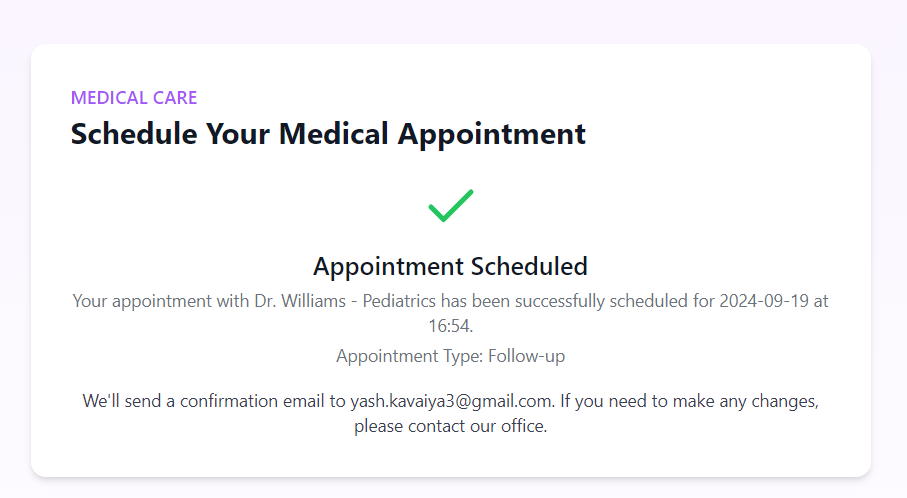
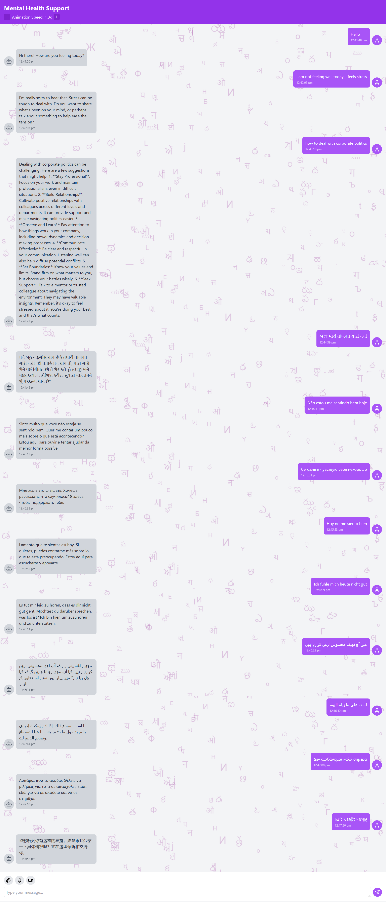

# MediRAG - Intelligent Healthcare Solutions

Demo Video :- https://youtube.com/live/yx53gaMwmXw
## Overview

This project is a comprehensive healthcare website built using JavaScript, TypeScript, and Node.js. It offers a range of features designed to improve patient care, streamline medical processes, and provide easy access to health-related information and services.


## Healthcare Application Architecture 



## Key Features

1. **X-ray and Document Diagnosis**
   - AI-powered analysis of medical images and documents
   - Quick and accurate diagnoses
   - Supports various file formats including images and PDFs

2. **Personalized Health Plans**
   - Tailored nutrition and sleep recommendations
   - Based on individual health profiles and goals
   - Includes diet plans and sleep routines

3. **Appointment Scheduling**
   - Easy booking of medical appointments
   - Selection of healthcare professionals
   - Management of appointment types and reasons for visit


4. **Mental Health Support**
   - 24/7 access to mental health resources
   - AI-assisted counseling
   - Integration with professional support services

## Technology Stack

- Frontend: React.js with TypeScript
- Backend: Node.js with Express
- AI Integration: OpenAI API
- Styling: Tailwind CSS

## Setup Instructions

1. Clone the repository:
   ```
   git clone https://github.com/your-username/healthcare-website.git
   cd healthcare-website
   ```

2. Install dependencies:
   ```
   npm install
   ```

3. Set up environment variables:
   - Create a `.env` file in the root directory
   - Add the following variables:
     ```
     PORT=3001
     OPENAI_API_KEY=your_openai_api_key
     DATABASE_URL=your_database_connection_string
     ```

4. Start the development server:
   ```
   npm run dev
   ```

5. Open your browser and navigate to `http://localhost:3000`

## API Endpoints

- `/api/analyze-image`: POST request to analyze medical images
- `/api/HealthPlans`: POST request to generate personalized health plans
- `/api/mental-health-chat`: POST request for mental health support chat
- (Add other endpoints as implemented)

## Contributing

We welcome contributions to improve the Healthcare Website. Please follow these steps:

1. Fork the repository
2. Create a new branch (`git checkout -b feature/AmazingFeature`)
3. Make your changes
4. Commit your changes (`git commit -m 'Add some AmazingFeature'`)
5. Push to the branch (`git push origin feature/AmazingFeature`)
6. Open a Pull Request

## License

This project is licensed under the MIT License - see the [LICENSE.md](LICENSE.md) file for details.

## Acknowledgments

- OpenAI for providing the AI models
- (Add any other libraries, tools, or resources used)

## Contact

Your Name - your.email@example.com

Project Link: https://github.com/your-username/healthcare-website

---
